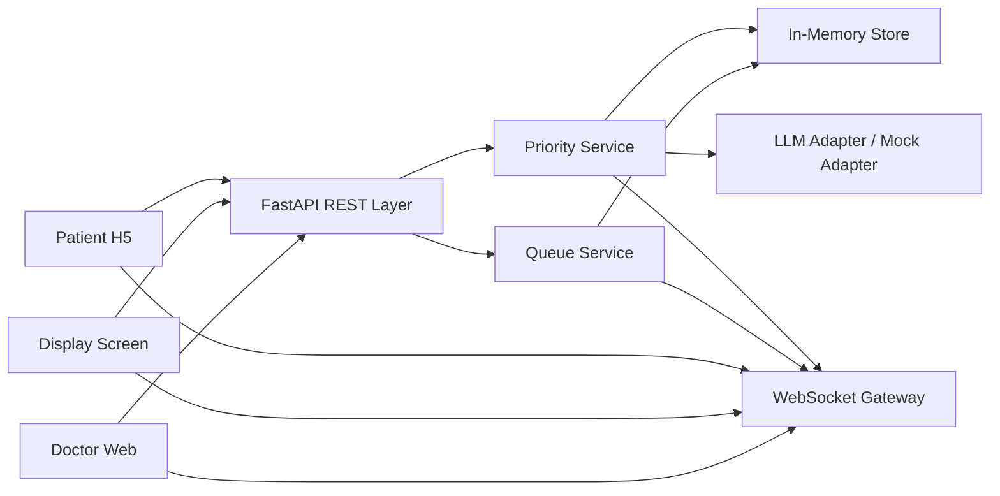
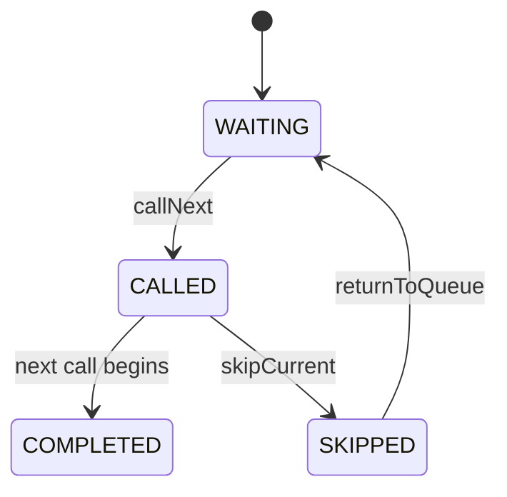
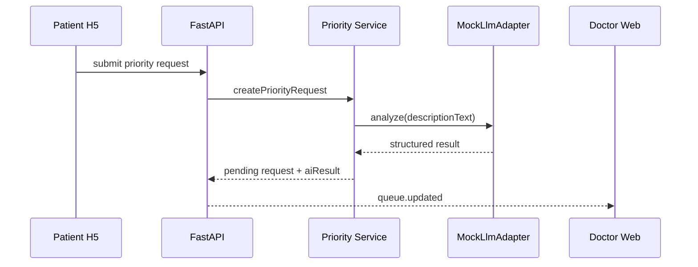

# MediQueue 后端 API 架构设计文档

技术栈：`Python 3.12 + FastAPI + Pydantic v2 + Uvicorn`

## 1. 文档目标

本文档基于 [./prd_v2.md](./prd_v2.md) 定义 MediQueue MVP 后端的边界、核心模块、REST API、WebSocket 事件和演示开发接口，供后端实现与前端联调使用。

## 2. 架构目标

本轮后端必须支持：
- 管理单诊室候诊队列
- 向医生端、大屏端、患者端提供统一状态快照
- 支持叫下一位、跳过、暂停、恢复
- 支持患者提交紧急优先申请
- 支持 AI 分析后由医生审核优先申请
- 通过 WebSocket 将关键状态实时同步给前端

本轮不纳入范围：
- 持久化数据库
- 审计日志系统
- 多院区 / 多诊室分布式调度
- 完整权限系统
- HIS / EMR 深度集成

## 3. 总体架构



## 4. 模块划分

### 4.1 API Layer

职责：
- 接收 REST 请求
- 参数校验
- 调用服务层
- 返回统一响应 envelope

实现建议：
- 使用 `APIRouter` 分模块组织
- 使用 Pydantic schema 定义请求体与响应体
- 所有业务状态变更优先走服务层，不直接操作 store

### 4.2 WebSocket Gateway

职责：
- 维护房间级连接
- 建立 `roomNo -> connections` 广播关系
- 首次连接后发送 `snapshot.sync`
- 队列变化后广播统一事件

当前连接模型：
- 医生端：`/ws/rooms/{room_no}?role=doctor`
- 大屏端：`/ws/rooms/{room_no}?role=display`
- 患者端：`/ws/rooms/{room_no}?role=patient&patientId=p_001`

### 4.3 Queue Service

职责：
- 维护候诊状态
- 处理 `call next / skip / pause / resume`
- 构建 `QueueSnapshot`
- 提供患者个人排队视图
- 提供演示环境下的队列重置

### 4.4 Priority Service

职责：
- 创建优先申请
- 调用 LLM / Mock 结构化分析
- 保存分析结果
- 接收医生审核结论
- 审核通过后调整候诊顺序

### 4.5 In-Memory Store

职责：
- 保存 room 状态
- 保存当前票号、等待列表、优先申请
- 提供 `snapshotVersion`
- 支持一键恢复初始 mock 数据

## 5. 核心数据模型

### 5.1 Patient

```python
class Patient(BaseModel):
    patient_id: str
    name: str
    gender: Literal["male", "female", "other"]
    english_name_or_pinyin: str | None = None
    language: Literal["zh-CN", "en-US"]
```

### 5.2 QueueTicket

```python
class QueueTicket(BaseModel):
    ticket_no: str
    patient: Patient
    room_no: str
    status: Literal[
        "WAITING",
        "CALLED",
        "SKIPPED",
        "IN_CONSULTATION",
        "COMPLETED",
        "MISSED",
    ]
    priority_level: Literal[
        "NORMAL",
        "PRIORITY_REVIEWING",
        "PRIORITY_APPROVED",
        "RETURNING",
    ]
    check_in_time: str
```

### 5.3 PriorityRequest

```python
class PriorityRequest(BaseModel):
    request_id: str
    ticket_no: str
    description_text: str
    ai_result: PriorityAiResult | None = None
    review_status: Literal["PENDING", "APPROVED", "REJECTED"]
    created_at: str
    reviewed_at: str | None = None
```

### 5.4 QueueSnapshot

```python
class QueueSnapshot(BaseModel):
    snapshot_version: str
    room_no: str
    current_call: QueueTicket | None
    waiting_list: list[QueueTicket]
    is_paused: bool
    pending_priority_requests: list[PriorityRequest]
    updated_at: str
```

## 6. 状态规则

### 6.1 票号状态流转



### 6.2 核心业务规则

1. 提交优先申请后，票号先进入 `PRIORITY_REVIEWING`，不会自动插队。
2. 医生审核通过后，票号改为 `PRIORITY_APPROVED` 并前移。
3. 医生审核拒绝后，票号恢复 `NORMAL`。
4. `isPaused = true` 时，不允许继续叫下一位。
5. 前端一律以最新 `QueueSnapshot` 为准，不在客户端本地推演整个队列。

## 7. REST API 设计

统一约定：
- Base Path：`/api/v1`
- Content-Type：`application/json`
- 时间格式：ISO 8601
- 统一响应结构：`success / data / error / meta`
- 修改接口支持 `expectedSnapshotVersion` 做冲突控制

统一响应示例：

```json
{
  "success": true,
  "data": {},
  "error": null,
  "meta": {
    "snapshotVersion": "2026-05-21T10:30:45.000Z"
  }
}
```

错误响应示例：

```json
{
  "success": false,
  "data": null,
  "error": {
    "code": "VERSION_CONFLICT",
    "message": "Snapshot version is outdated."
  }
}
```

### 7.1 队列查询

- `GET /api/v1/queue?roomNo=101`
- `GET /api/v1/patients/{patient_id}/queue-view`

### 7.2 医生调度

- `POST /api/v1/calls/next`
- `POST /api/v1/calls/recall`
- `POST /api/v1/calls/skip`
- `POST /api/v1/calls/pause`
- `POST /api/v1/calls/resume`

### 7.3 优先申请

- `POST /api/v1/priority-requests`
- `POST /api/v1/priority-requests/{request_id}/review`

### 7.4 健康检查

- `GET /api/v1/health`

### 7.5 演示开发接口

- `POST /api/v1/dev/reset`

用途：
- 仅供联动中心和本地演示使用
- 将内存队列恢复到初始 mock 状态
- 清空当前叫号、暂停状态和优先申请列表

请求示例：

```json
{
  "roomNo": "101"
}
```

成功后，后端会广播一次 `queue.updated`，让三端立即回到统一初始状态。

## 8. WebSocket 事件设计

连接地址：
- `WS /ws/rooms/{room_no}`

事件列表：

| 事件名 | 触发时机 | 接收端 |
| --- | --- | --- |
| `snapshot.sync` | 首次连接 / 重连成功后 | 全部 |
| `queue.updated` | 队列顺序变化 | 全部 |
| `call.started` | 医生叫下一位 | 全部 |
| `call.skipped` | 医生跳过当前 | 全部 |
| `call.paused` | 医生暂停叫号 | 全部 |
| `call.resumed` | 医生恢复叫号 | 全部 |
| `priority.reviewed` | 医生审核优先申请 | 医生端、患者端 |

说明：
- 医生端和大屏端直接使用广播里的 `QueueSnapshot`
- 患者端收到房间事件后重新拉取自己的 `queue-view`

## 9. AI 调用链



当前策略：
- 有真实 LLM 时可替换 adapter
- 无真实密钥时保持 `MockLlmAdapter`
- 输出必须是结构化结果，而不是自由文本

## 10. 断网与重连策略

前端满足以下任一条件时进入断网展示：
- WebSocket 断开
- 多次重连失败
- 健康检查连续失败

后端侧配合点：
- 重连成功后立即下发 `snapshot.sync`
- 队列状态变更总是附带最新 snapshot

本轮不做离线写入和补偿同步，只做：
- 断网态识别
- 旧快照展示
- 恢复后重新对齐

## 11. 推荐实现结构

```text
api/src/api/
  main.py
  routes/
    queue.py
    calls.py
    priority.py
    dev.py
    health.py
    websocket.py
  schemas/
    common.py
    patient.py
    queue.py
    priority.py
    dev.py
  services/
    queue_service.py
    priority_service.py
    connection_manager.py
  adapters/
    llm_adapter.py
    mock_llm_adapter.py
  store/
    in_memory_store.py
  core/
    config.py
    enums.py
    errors.py
```

## 12. 验收检查点

- `GET /api/v1/queue` 能返回标准化快照
- `GET /api/v1/patients/{patient_id}/queue-view` 能返回患者个人视图
- `call next / skip / pause / resume` 会改变状态并触发广播
- 优先申请能返回结构化 `aiResult`
- `POST /api/v1/dev/reset` 能把 demo 队列恢复到初始状态
- WebSocket 重连后能重新拿到 `snapshot.sync`

## 13. 相关文档

- 产品需求：[./prd_v2.md](./prd_v2.md)
- 前端架构：[./frontend_architecture.md](./frontend_architecture.md)
- 设计风格：[./design.md](./design.md)
- 后端使用说明：[../api/README.md](../api/README.md)
