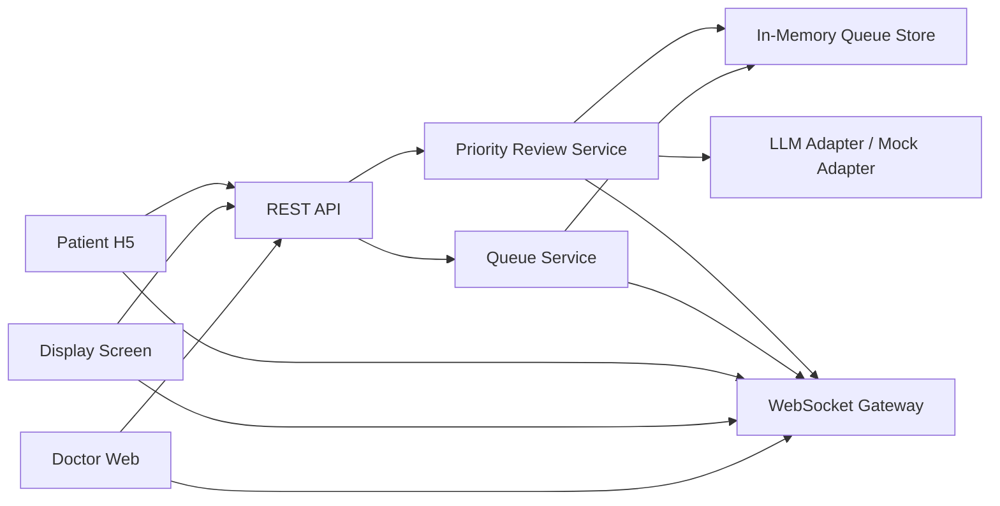
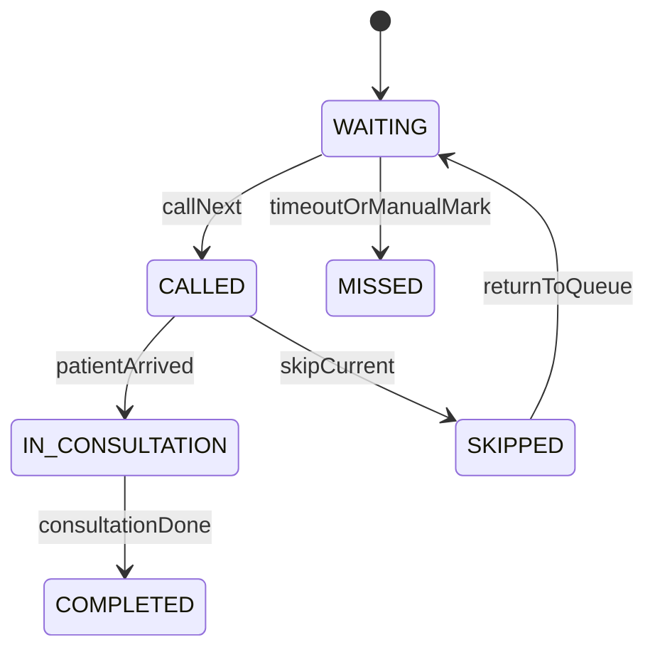
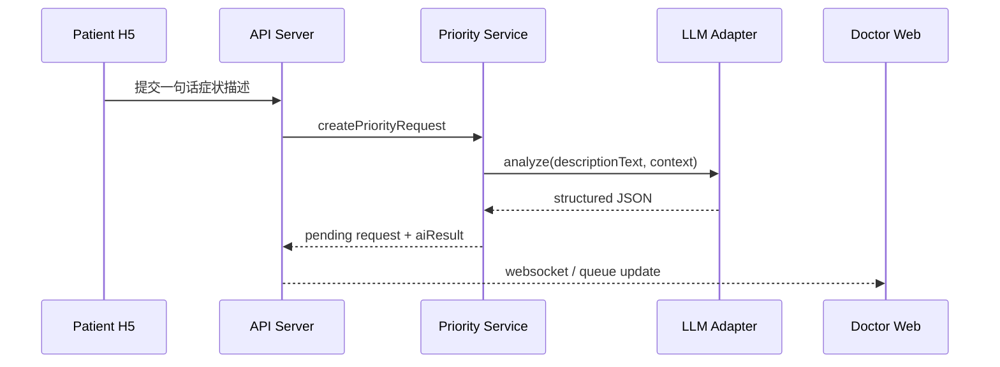

# MediQueue 后端 API 架构设计文档

`技术栈：Python + FastAPI`

## 1. 文档目标

本文档基于 [prd_v2.md](./prd_v2.md)，定义 MediQueue MVP 后端服务的架构边界、核心模块、REST API、WebSocket 事件、AI 调用链与状态管理方式，供后端开发直接实现。

## 2. 架构目标

### 2.1 本轮后端必须支撑的能力

- 管理一个诊室内存候诊队列
- 向三端提供统一状态快照
- 支持医生发起叫号、跳过、暂停、恢复
- 支持患者发起紧急优先申请
- 支持 AI 分析后由医生审核优先申请
- 通过 WebSocket 将关键状态变化实时广播给各端

### 2.2 推荐技术栈

- Python `3.12`
- FastAPI
- Uvicorn
- Pydantic v2
- asyncio
- FastAPI 原生 `WebSocket`

FastAPI 被选为本轮后端框架的原因：

1. REST API 与 WebSocket 都可以在同一服务内统一实现
2. Pydantic 模型天然适合当前需要的结构化 JSON 输入输出
3. Python 更适合后续接入 LLM SDK、Mock 推理逻辑和规则判断
4. 对于题目要求的 MVP，FastAPI 可以快速形成清晰、稳定、可调试的接口层

### 2.3 本轮不纳入范围

- 持久化数据库设计
- 审计日志系统
- 用户认证与复杂 RBAC
- 多院区/多科室分布式队列
- HIS/EMR 双向集成

## 3. 总体架构



## 4. 模块划分

### 4.1 API Layer

职责：

- 接收 REST 请求
- 做参数校验
- 调用业务服务
- 返回统一 JSON 响应

FastAPI 对应实现建议：

- 使用 `APIRouter` 按模块拆分接口
- 使用 Pydantic `BaseModel` 定义请求体和响应体
- 使用依赖注入管理共享服务实例

### 4.2 WebSocket Gateway

职责：

- 维护客户端连接
- 处理订阅关系
- 广播队列更新、叫号变更、优先审核结果
- 在客户端重连后触发快照同步

FastAPI 对应实现建议：

- 使用 `fastapi.WebSocket` 建立长连接
- 封装 `ConnectionManager` 维护 `roomNo -> connections` 映射
- 连接建立后先发送一次 `snapshot.sync`
- 断开连接时自动清理订阅关系

### 4.3 Queue Service

职责：

- 管理队列主状态
- 提供“呼叫下一位”“跳过当前”“暂停/恢复”能力
- 输出标准化 `QueueSnapshot`

### 4.4 Priority Review Service

职责：

- 接收患者紧急优先申请
- 调用 LLM 或 Mock 分析
- 保存 AI 结果
- 提供医生审批入口
- 审批通过后调整队列排序

### 4.5 LLM Adapter

职责：

- 统一封装真实 LLM API 调用
- 无 Key 时切换到 Mock 策略
- 输出结构化 JSON，而不是自由文本

### 4.6 In-Memory Queue Store

职责：

- 保存本轮 MVP 的全部运行状态
- 提供当前快照版本号
- 保存队列、当前叫号、优先申请列表

## 5. 核心数据模型

### 5.1 Patient

```python
from typing import Literal
from pydantic import BaseModel


class Patient(BaseModel):
    patient_id: str
    name: str
    gender: Literal["male", "female", "other"]
    english_name_or_pinyin: str | None = None
    language: Literal["zh-CN", "en-US"]
```

### 5.2 QueueTicket

```python
from typing import Literal
from pydantic import BaseModel


class QueueTicket(BaseModel):
    ticket_no: str
    patient: Patient
    room_no: str
    status: Literal[
        "WAITING",
        "CALLED",
        "SKIPPED",
        "IN_CONSULTATION",
        "COMPLETED",
        "MISSED",
    ]
    priority_level: Literal[
        "NORMAL",
        "PRIORITY_REVIEWING",
        "PRIORITY_APPROVED",
        "RETURNING",
    ]
    check_in_time: str
```

### 5.3 PriorityRequest

```python
from typing import Literal
from pydantic import BaseModel


class PriorityRequest(BaseModel):
    request_id: str
    ticket_no: str
    description_text: str
    ai_result: "PriorityAiResult | None" = None
    review_status: Literal["PENDING", "APPROVED", "REJECTED"]
    created_at: str
    reviewed_at: str | None = None
```

### 5.4 PriorityAiResult

```python
from typing import Literal
from pydantic import BaseModel


class PriorityAiResult(BaseModel):
    urgency_level: Literal["high", "medium", "low", "unknown"]
    medical_reason: bool
    is_abuse_suspected: bool
    recommended_action: Literal[
        "approve_priority",
        "reject_non_medical",
        "manual_review",
    ]
    explanation: str
```

### 5.5 QueueSnapshot

```python
from pydantic import BaseModel


class QueueSnapshot(BaseModel):
    snapshot_version: str
    room_no: str
    current_call: QueueTicket | None = None
    waiting_list: list[QueueTicket]
    is_paused: bool
    pending_priority_requests: list[PriorityRequest]
    updated_at: str
```

## 6. 状态机与业务规则

### 6.1 票号状态流转



### 6.2 核心规则

1. `PriorityRequest` 创建后，只改变 `priorityLevel = PRIORITY_REVIEWING`，不自动插队。
2. 医生审核通过后，对应票号改为 `PRIORITY_APPROVED` 并前移。
3. 医生审核拒绝后，票号恢复 `NORMAL` 优先级。
4. 当 `isPaused = true` 时，`callNext` 和 `skipCurrent` 默认禁止执行。
5. 客户端所有展示都应以最新 `QueueSnapshot` 为准。

## 7. REST API 设计

### 7.1 统一约定

- Base Path：`/api/v1`
- 请求/响应格式：`application/json`
- 时间格式：ISO 8601
- 修改型接口建议携带 `expectedSnapshotVersion`
- 路径参数写法遵循 FastAPI / OpenAPI 习惯，使用 `{param_name}`

统一响应结构：

```json
{
  "success": true,
  "data": {},
  "error": null,
  "meta": {
    "snapshotVersion": "2026-05-21T10:30:45.000Z"
  }
}
```

错误结构：

```json
{
  "success": false,
  "data": null,
  "error": {
    "code": "VERSION_CONFLICT",
    "message": "Snapshot version is outdated."
  }
}
```

### 7.2 获取完整队列

`GET /api/v1/queue?roomNo=101`

功能：

- 给医生端、大屏端获取完整队列快照

响应示例：

```json
{
  "success": true,
  "data": {
    "snapshotVersion": "2026-05-21T10:30:45.000Z",
    "roomNo": "101",
    "currentCall": null,
    "waitingList": [],
    "isPaused": false,
    "pendingPriorityRequests": [],
    "updatedAt": "2026-05-21T10:30:45.000Z"
  },
  "error": null
}
```

### 7.3 获取患者个人视图

`GET /api/v1/patients/{patient_id}/queue-view`

功能：

- 给患者端获取“我的号码、前方人数、预计等待时间、诊室号、当前状态”

响应字段建议：

```json
{
  "patientId": "p_001",
  "ticketNo": "A012",
  "status": "WAITING",
  "roomNo": "101",
  "peopleAhead": 3,
  "estimatedWaitMinutes": 18,
  "isPaused": false,
  "isOfflineSnapshot": false
}
```

### 7.4 医生呼叫下一位

`POST /api/v1/calls/next`

请求体：

```json
{
  "roomNo": "101",
  "expectedSnapshotVersion": "2026-05-21T10:30:45.000Z"
}
```

功能：

- 取队列中下一位有效候诊患者
- 设置为 `CALLED`
- 更新 `currentCall`
- 广播 `call.started` 与 `queue.updated`

### 7.5 医生跳过当前

`POST /api/v1/calls/skip`

请求体：

```json
{
  "roomNo": "101",
  "ticketNo": "A012",
  "expectedSnapshotVersion": "2026-05-21T10:31:12.000Z"
}
```

功能：

- 将当前叫号患者标记为 `SKIPPED`
- 广播 `call.skipped`

### 7.6 暂停叫号

`POST /api/v1/calls/pause`

请求体：

```json
{
  "roomNo": "101"
}
```

功能：

- 设置 `isPaused = true`
- 广播 `call.paused`

### 7.7 恢复叫号

`POST /api/v1/calls/resume`

请求体：

```json
{
  "roomNo": "101"
}
```

功能：

- 设置 `isPaused = false`
- 广播 `call.resumed`

### 7.8 提交紧急优先申请

`POST /api/v1/priority-requests`

请求体：

```json
{
  "ticketNo": "A018",
  "descriptionText": "孕36周，持续腹痛，越来越明显"
}
```

功能：

- 创建 `PriorityRequest`
- 调用 LLM / Mock
- 将票号优先级设为 `PRIORITY_REVIEWING`
- 广播“有待审核申请”的队列更新

响应体示例：

```json
{
  "success": true,
  "data": {
    "requestId": "pr_001",
    "reviewStatus": "PENDING",
    "aiResult": {
      "urgencyLevel": "high",
      "medicalReason": true,
      "isAbuseSuspected": false,
      "recommendedAction": "approve_priority",
      "explanation": "孕晚期腹痛可能存在产科风险，建议优先评估。"
    }
  },
  "error": null
}
```

### 7.9 医生审核优先申请

`POST /api/v1/priority-requests/{request_id}/review`

请求体：

```json
{
  "decision": "APPROVE",
  "roomNo": "101",
  "expectedSnapshotVersion": "2026-05-21T10:32:01.000Z"
}
```

功能：

- 根据 `decision` 进行批准或拒绝
- 若批准：票号前移并改为 `PRIORITY_APPROVED`
- 若拒绝：票号恢复 `NORMAL`
- 广播 `priority.reviewed` 与 `queue.updated`

### 7.10 健康检查

`GET /api/v1/health`

功能：

- 提供给前端做服务探活与断网判断

响应示例：

```json
{
  "success": true,
  "data": {
    "status": "ok",
    "serverTime": "2026-05-21T10:35:30.000Z"
  },
  "error": null
}
```

## 8. WebSocket 设计

### 8.1 连接地址

建议：

- `ws://host/ws`
- 或按诊室划分为 `ws://host/ws/rooms/{room_no}`

### 8.2 客户端订阅模型

如果采用单入口 WebSocket，可在连接后发送订阅消息：

```json
{
  "type": "subscribe",
  "roomNo": "101",
  "patientId": "p_001"
}
```

说明：

- 医生端和大屏端按 `roomNo` 订阅
- 患者端按 `patientId + roomNo` 订阅

如果采用 FastAPI 路径参数式 WebSocket，也可以设计为：

- 医生端：`/ws/rooms/{room_no}?role=doctor`
- 大屏端：`/ws/rooms/{room_no}?role=display`
- 患者端：`/ws/rooms/{room_no}?role=patient&patientId=p_001`

### 8.3 事件列表

| 事件名 | 触发时机 | 主要接收端 |
| --- | --- | --- |
| `snapshot.sync` | 初次连接/重连成功后 | 所有端 |
| `queue.updated` | 队列顺序变化 | 所有端 |
| `call.started` | 医生呼叫下一位 | 所有端 |
| `call.skipped` | 医生跳过当前 | 所有端 |
| `call.paused` | 医生暂停叫号 | 所有端 |
| `call.resumed` | 医生恢复叫号 | 所有端 |
| `priority.reviewed` | 医生审核优先申请 | 医生端、患者端 |

### 8.4 事件载荷示例

`call.started`

```json
{
  "type": "call.started",
  "payload": {
    "roomNo": "101",
    "currentCall": {
      "ticketNo": "A012",
      "displayName": "李X伟 先生",
      "roomNo": "101"
    },
    "snapshotVersion": "2026-05-21T10:31:12.000Z"
  }
}
```

`priority.reviewed`

```json
{
  "type": "priority.reviewed",
  "payload": {
    "requestId": "pr_001",
    "ticketNo": "A018",
    "decision": "APPROVE",
    "snapshotVersion": "2026-05-21T10:32:01.000Z"
  }
}
```

## 9. AI 调用链设计

### 9.1 调用流程



### 9.2 Mock 策略

若无真实 API Key：

- 保留完整 Prompt
- 在 `LlmAdapter` 中切换为 `MockLlmAdapter`
- 按关键词返回结构化结果

示例 Mock 规则：

- 含“胸闷”“气短”“大量出血”“孕36周腹痛” -> `high`
- 含“VIP”“赶时间”“上班要迟到” -> `reject_non_medical`
- 无法识别 -> `unknown`

## 10. 断网与重连策略

### 10.1 客户端断网判断

前端满足以下任一条件时进入断网展示模式：

- WebSocket 断开
- 多次重连失败
- `GET /api/v1/health` 连续失败

### 10.2 断网时后端配合点

- 最近一次成功的 `QueueSnapshot` 必须可缓存于客户端
- API 恢复后，客户端重新拉取完整快照
- WebSocket 重连后立即下发 `snapshot.sync`

### 10.3 为什么不做复杂离线写入

根据当前 PRD 范围，本轮不做真正的离线可写与补偿同步，只做：

- 断网态识别
- 旧快照展示
- 恢复后状态重拉

## 11. 错误码建议

| 错误码 | 含义 |
| --- | --- |
| `VALIDATION_ERROR` | 参数错误 |
| `ROOM_NOT_FOUND` | 诊室不存在 |
| `TICKET_NOT_FOUND` | 票号不存在 |
| `NO_WAITING_PATIENT` | 当前无可叫号患者 |
| `ROOM_PAUSED` | 当前诊室已暂停叫号 |
| `REQUEST_NOT_FOUND` | 优先申请不存在 |
| `REQUEST_ALREADY_REVIEWED` | 申请已审核 |
| `VERSION_CONFLICT` | 快照版本冲突 |
| `AI_UNAVAILABLE` | AI 服务不可用 |

## 12. 实现建议

### 12.1 推荐服务结构

```text
src/
  app/
    main.py
    api/
      queue.py
      calls.py
      priority.py
      health.py
      websocket.py
    schemas/
      patient.py
      queue.py
      priority.py
      common.py
    services/
      queue_service.py
      priority_service.py
      snapshot_service.py
      connection_manager.py
    adapters/
      llm_adapter.py
      mock_llm_adapter.py
    store/
      in_memory_store.py
    core/
      config.py
      enums.py
```

如需最小可运行服务，`main.py` 建议结构如下：

```python
from fastapi import FastAPI
from app.api import queue, calls, priority, health, websocket


app = FastAPI(title="MediQueue API", version="0.1.0")

app.include_router(queue.router, prefix="/api/v1")
app.include_router(calls.router, prefix="/api/v1")
app.include_router(priority.router, prefix="/api/v1")
app.include_router(health.router, prefix="/api/v1")
app.include_router(websocket.router)
```

### 12.2 推荐实现顺序

1. 先完成内存队列与 `GET /queue`
2. 再完成 `call next / skip / pause / resume`
3. 接入 FastAPI WebSocket 广播
4. 最后实现 `priority request + AI analyze + doctor review`

## 13. 验收检查点

### 13.1 基础接口

- `GET /queue` 能返回标准化快照
- `GET /patients/{patient_id}/queue-view` 能返回患者个人视图

### 13.2 实时能力

- 医生触发叫号后 1 秒内完成 WebSocket 广播
- 客户端重连后能恢复到最新状态

### 13.3 AI 能力

- 优先申请能返回结构化 JSON
- 医生审核接口能真正改变队列顺序或恢复普通优先级

### 13.4 异常能力

- 后端健康接口可用于前端判断服务可用性
- 快照版本冲突时能返回明确错误
