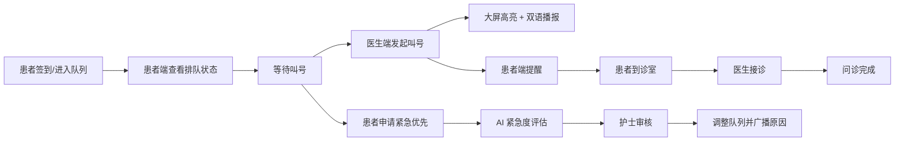

# MediQueue 产品需求文档（PRD）

## 1. 文档概述

### 1.1 文档目的

本文档基于 [native_description.md](/F:/Project/MediQueue/docs/native_description.md) 中的原始反馈，重新建模医院智能叫号系统的业务背景、角色诉求、流程规则与产品范围，形成一份可指导设计、开发、测试和验收的正式 PRD。

### 1.2 产品定位

MediQueue 是一个面向医院门诊场景的多端实时叫号系统，服务对象包括患者、医生、护士/分诊台以及候诊区大屏。产品目标是在保证医疗秩序和患者安全的前提下，解决“看不见、听不清、难解释、不可调、断网即瘫痪”的核心问题。

### 1.3 适用范围

- 场景范围：医院门诊候诊与叫号场景
- 角色范围：患者、医生、护士/分诊人员、院方管理者
- 语言范围：中文、英文
- 终端范围：医生端 Web、候诊大屏端、患者移动端 H5、后端服务

### 1.4 版本目标

本文档定义的是 `MVP 版本` 需求，优先验证以下关键能力：

- 队列透明化与实时同步
- 中英文双语支持
- 紧急优先申请与可解释插队
- 面向老年患者的可视化增强
- 断网情况下的安全降级

### 1.5 关键假设

- MVP 先覆盖单院区门诊叫号场景，不覆盖住院、急诊、检验、缴费等全链路业务。
- 患者已有基础挂号记录，MVP 中可通过模拟数据或外部导入形成待叫号队列。
- 紧急优先申请的最终执行权仍归护士/分诊人员，AI 仅提供辅助判断。
- 候诊区硬件具备联网电视/大屏、浏览器运行环境以及基础音频播报能力。

## 2. 业务背景与问题定义

### 2.1 当前业务现状

现有系统已运行 5 年，每日服务约 800 名患者，但在真实使用中出现以下问题：

- 老年患者看不清屏幕、听不清广播，导致过号与重复排队。
- 外籍患者无法理解中文屏幕和播报，无法独立完成候诊。
- 紧急患者缺乏被优先识别和处理的机制，只能依赖人工临时干预。
- 医生无法获得稳定、有序、可信的就诊队列，被频繁打断。
- 护士在插队处理时缺乏统一依据和可解释机制，容易引发纠纷。
- 网络一旦中断，系统整体瘫痪，存在医疗安全风险。

### 2.2 核心业务矛盾

系统需要同时满足四个目标，而现状中它们彼此冲突：

1. 公平性：大多数患者希望排队规则稳定、透明、可解释。
2. 灵活性：孕妇、急症等特殊人群需要被动态优先处理。
3. 易用性：老年人、外籍人士需要低门槛、低认知负担的交互方式。
4. 安全性：在网络异常、人员拥挤、声音嘈杂等条件下，系统仍需持续可用。

### 2.3 产品要解决的核心问题

- 患者是否能清楚知道“我是谁、我排到哪、什么时候到我”
- 医护是否能以低成本管理“可调整但不失控”的队列
- 插队/优先是否可以被系统记录、审核并对外解释
- 多端信息是否始终一致，且在断网后仍可继续最低风险运行

## 3. 产品目标与非目标

### 3.1 产品目标

- 降低过号率，减少患者重复询问与医生被打断次数。
- 提供中英双语、远距可视、移动提醒等无障碍能力。
- 建立紧急优先申请机制，支持 AI 辅助评估与人工确认。
- 实现医生端、大屏端、患者端的 1 秒内实时同步。
- 提供断网检测、离线运行与恢复同步能力，保障门诊连续性。

### 3.2 非目标

以下内容不属于本次 MVP 范围：

- 与 HIS/EMR/挂号收费系统的深度双向集成
- 完整急诊分诊系统
- 支付、保险结算、病历查看等诊疗外围能力
- 面向所有语种的国际化能力，MVP 仅支持中文和英文
- 复杂排班、医生绩效、门诊经营分析等后台运营系统

## 4. 用户角色与画像

### 4.1 角色定义

| 角色 | 典型代表 | 核心目标 | 主要痛点 |
| --- | --- | --- | --- |
| 患者（老年） | 王大爷 | 不错过叫号、少走动、少等待 | 看不清、听不见、过号后成本高 |
| 患者（外籍） | David Smith | 看得懂、听得懂、独立完成候诊 | 无英文界面、无英文播报 |
| 患者（特殊紧急） | 李女士 | 在症状恶化前尽快被处理 | 现有系统无法动态调序 |
| 医生 | 赵主任 | 保持问诊节奏、减少无效打断 | 患者反复敲门、队列不透明 |
| 护士/分诊 | 张姐 | 维持秩序、合理优先、可解释 | 插队引发争议、真假紧急难辨、断网无预案 |
| 院方管理者 | 门诊管理者 | 安全、合规、可复制推广 | 投诉风险、事故风险、运营不可控 |

### 4.2 角色核心诉求

- 患者需要“明确感知”和“及时提醒”，而不是被动等待。
- 医生需要“可信队列”和“低打扰环境”，而不是临场维持秩序。
- 护士需要“有依据的决策工具”和“异常场景兜底机制”。
- 管理者需要“可被追溯、可被解释、可被审计”的系统。

## 5. 业务建模

### 5.1 业务对象模型

| 对象 | 说明 | 核心字段 |
| --- | --- | --- |
| 患者 Patient | 候诊人员基础身份 | 患者ID、姓名、英文名/拼音、年龄、语言偏好、特殊标签 |
| 就诊单 Visit | 一次具体门诊就诊任务 | 就诊单ID、科室、诊室、预约时间、就诊类型 |
| 排队票号 QueueTicket | 一次排队凭证与排序单元 | 票号、当前序位、状态、优先级、签到时间 |
| 紧急优先申请 PriorityRequest | 患者发起的插队/优先请求 | 申请ID、描述文本、AI结果、人工审核结果、理由 |
| 叫号事件 CallEvent | 一次实际叫号动作 | 事件ID、票号、诊室、发起人、时间、播报状态 |
| 队列快照 QueueSnapshot | 某时刻完整队列状态 | 当前叫号、待叫列表、暂停状态、版本号 |
| 终端设备 Terminal | 系统访问入口 | 设备ID、终端类型、在线状态、最后同步时间 |
| 审计记录 AuditLog | 关键动作留痕 | 操作人、动作、前后状态、时间、备注 |

### 5.2 队列状态模型

`QueueTicket` 在系统中需要支持以下状态：

- `WAITING`：已进入队列，等待叫号
- `CALLED`：已被叫号，等待患者到诊室
- `SKIPPED`：本轮未到场，被临时跳过
- `IN_CONSULTATION`：已进入问诊
- `COMPLETED`：本次问诊完成
- `MISSED`：长时间未到，判定过号
- `PAUSED`：受全局暂停影响，临时冻结推进

### 5.3 队列优先级模型

队列顺序由以下因素共同决定：

1. 紧急等级
2. 原始排队顺序
3. 分诊人工确认结果
4. 当前是否已被叫号/跳过

建议优先级分层：

- `P_EMERGENCY`：紧急优先，需护士确认后插队
- `P_STANDARD`：普通候诊
- `P_RETURN`：过号重回队列，默认回到指定位置而非末尾

### 5.4 核心业务规则

1. 紧急优先申请不等于自动插队。患者提交后，AI 先做紧急度评估，再由护士确认是否前移。
2. 非医疗理由不能构成优先依据。如“我是 VIP”“我赶时间”等必须被识别为无效优先理由。
3. 所有队列调整必须留痕，且对护士端可见，对患者端要可解释。
4. 大屏展示以号码为主、姓名为辅，优先保证识别效率；是否全名展示可由院方配置。
5. 医生只能操作与自己诊室相关的叫号，不应直接修改全局优先级规则。
6. 系统暂停时，不得继续自动推进下一位，但允许查看当前队列和关键状态。
7. 断网期间必须允许继续最低限度叫号，但不能产生无法追溯的黑盒操作。

### 5.5 核心业务流程



### 5.6 异常流程

- 患者未到：医生端可执行“跳过当前”，票号进入 `SKIPPED` 状态。
- 患者过号后返回：由护士按规则恢复到指定区间，避免从头或完全重排。
- 网络断开：系统进入离线降级模式，启用本地只读快照与手工叫号策略。
- AI 评估失败：护士仍可根据人工分诊结果处理，系统记录“AI 未参与/失败”。

## 6. 需求范围与版本规划

### 6.1 MVP 范围

MVP 必须覆盖以下最小闭环：

- 患者可查看自己的票号、前方人数、预计等待时间
- 医生可发起叫号、跳过当前、暂停叫号
- 候诊大屏可实时展示当前叫号与前排队列
- 系统支持中文/英文展示和双语播报
- 患者可提交紧急优先申请，系统返回结构化评估结果
- 护士可审核优先申请并更新队列
- 关键数据可在刷新后恢复到当前一致状态
- 网络异常时存在可执行的离线降级方案

### 6.2 后续版本方向

- 与挂号/HIS 集成自动拉号
- 多科室、多楼层联动
- 更细粒度的隐私配置
- 预计等待时长的机器学习优化
- 支持更多语言和特殊提醒设备

## 7. 详细功能需求

### 7.1 后端服务

#### 7.1.1 队列管理

- 系统维护每个诊室独立队列。
- 支持初始化候诊列表、查询完整队列、查询当前叫号、查询患者个人状态。
- 支持叫号、跳过、暂停、恢复、完成问诊等动作。
- 支持票号状态机校验，防止非法状态跳转。

#### 7.1.2 实时消息能力

- 提供 WebSocket 通道向所有终端广播队列变更。
- 广播事件至少包括：
  - 当前叫号变更
  - 队列顺序变更
  - 系统暂停/恢复
  - 紧急优先申请结果
  - 断网/恢复状态提示
- 客户端断线后需自动重连并拉取最新快照。

#### 7.1.3 紧急优先服务

- 接收患者提交的症状/理由文本。
- 调用 LLM 完成结构化紧急度评估。
- 输出字段至少包括：
  - `urgencyLevel`
  - `medicalReason`
  - `isAbuseSuspected`
  - `recommendedAction`
  - `explanation`
- 将结果提供给护士审核，不直接自动改序。

#### 7.1.4 审计与可追溯

- 所有影响队列顺序的操作必须记录操作人、时间、动作前后顺序、备注。
- 所有 AI 评估结果必须可追溯，便于事后复盘。

### 7.2 医生端

#### 7.2.1 页面目标

帮助医生快速掌握当前候诊情况并低成本推进叫号，减少被患者打断。

#### 7.2.2 核心功能

- 查看当前叫号对象与待叫队列
- 操作“呼叫下一位”
- 操作“跳过当前”
- 操作“暂停叫号/恢复叫号”
- 查看特殊标记患者，例如已优先、已跳过、返回重排

#### 7.2.3 交互要求

- 当前叫号对象需要高亮显示
- 危急/特殊标记需有明显但不过度干扰的提示
- 关键动作需防误触，例如暂停叫号需二次确认

### 7.3 护士/分诊端

> 原始题目未强制要求单独实现护士端界面，但从真实业务看，它是闭环成立的关键角色，因此在 PRD 中纳入 MVP 需求。

#### 7.3.1 页面目标

帮助护士处理插队争议、审核紧急优先申请、解释队列变化并在异常场景下维持秩序。

#### 7.3.2 核心功能

- 查看全队列与变更原因
- 查看待审核的紧急优先申请
- 查看 AI 紧急度评估结果与原始文本
- 审核通过/驳回优先申请
- 手动调整患者位置并填写理由
- 处理过号患者重返队列
- 在断网模式下执行人工叫号登记

#### 7.3.3 可解释性要求

- 当队列发生优先插入时，护士端必须能展示“为什么调整”
- 患者端和大屏端不展示详细病情，但应展示简化提示，例如“当前有特殊优先患者，请按现场指引等候”

### 7.4 候诊大屏端

#### 7.4.1 页面目标

让远距离、嘈杂环境中的患者也能快速识别当前叫号和自己是否即将到达。

#### 7.4.2 展示内容

- 当前叫号：号码、姓名/简化名、诊室
- 等待队列前 5 位
- 当前系统状态：正常叫号、暂停、网络异常
- 中英文提示文案

#### 7.4.3 视觉要求

- 主号信息字号建议不低于 `48px`
- 采用高对比配色
- 当前叫号对象需高亮、闪烁或动画强调
- 列表信息密度低于传统表格，优先保证识别效率

#### 7.4.4 语音播报要求

- 每次成功叫号后触发播报
- 顺序：中文播报 -> 间隔 0.5 秒 -> 英文播报
- 支持浏览器 TTS 或后端音频资源方案

### 7.5 患者端

#### 7.5.1 页面目标

让患者随时从移动端确认自身排队状态，并在即将到号时收到强提醒。

#### 7.5.2 核心功能

- 显示我的票号、当前状态、前方人数
- 显示预估等待时间
- 显示诊室位置或名称
- 发起紧急优先申请
- 在被叫号时弹出强提示，并触发震动
- 展示中英双语界面

#### 7.5.3 业务规则

- 患者只能查看与自己相关的个人排队信息
- 紧急优先申请需填写一句话理由，提交后不可频繁重复刷请求
- 被驳回后可看到“未满足医疗优先条件”的简化反馈

### 7.6 院方管理视角

MVP 可不做独立后台，但需要为后续管理留出数据基础：

- 每日过号率
- 平均等待时间
- 紧急优先申请通过率
- 插队争议次数
- 系统离线时长与恢复时长

## 8. AI 能力需求

### 8.1 AI 紧急度评估

#### 8.1.1 目标

帮助护士快速筛查真正紧急的症状，降低“靠情绪争抢插队”的概率。

#### 8.1.2 输入

- 患者自由文本描述
- 可选上下文：年龄、孕周、既往标签、当前科室

#### 8.1.3 输出

输出必须是结构化 JSON，不允许只返回自然语言段落。

示例字段：

```json
{
  "urgencyLevel": "high",
  "medicalReason": true,
  "isAbuseSuspected": false,
  "recommendedAction": "manual_review_priority",
  "explanation": "孕36周腹痛，存在产科急症风险，建议护士立即复核。"
}
```

#### 8.1.4 规则要求

- 必须识别危急症状关键词及其组合语义
- 必须对“赶时间”“VIP”“我要上班”等非医疗理由做降权或拒绝
- 必须允许“无法判断”结果，避免假阳性自动插队
- 最终决策必须由人工确认

### 8.2 双语语音播报

#### 8.2.1 目标

确保外籍患者、低头看手机患者、视力不佳患者都能在不同感官通道收到提醒。

#### 8.2.2 播报模板

- 中文：`请 {号码} 号 {姓名}，到 {诊室} 就诊`
- 英文：`Number {号码}, {EnglishName/Pinyin}, please proceed to {诊室}`

#### 8.2.3 质量要求

- 中英文播报必须与当前叫号对象一致
- 播报失败时页面需保留视觉提醒，不影响主流程
- 若英文名缺失，允许自动回退到拼音或号码优先播报

## 9. 非功能需求

### 9.1 实时性

- 医生端触发叫号后，大屏端和患者端应在 `1 秒内` 完成状态更新
- 队列变更事件必须可广播，不依赖页面刷新

### 9.2 一致性

- 任一终端刷新页面后都能恢复到最新队列快照
- 客户端本地状态仅作缓存，服务端状态为唯一事实来源

### 9.3 可用性

- WebSocket 断线后自动重连
- 重连成功后自动拉取最新快照补齐中间事件
- 系统支持断网降级与恢复同步

### 9.4 无障碍

- 大字号、高对比度
- 中英文双语
- 移动端强提醒与震动
- 核心信息避免只依赖颜色表达

### 9.5 安全与隐私

- 患者个人信息遵循最小必要展示原则
- 日志中不得记录超出需求的敏感病情内容
- AI 请求与返回需保留审计，但应限制访问权限

## 10. 功能优先级矩阵

### 10.1 P0（MVP 必须）

| 功能 | 说明 | 理由 |
| --- | --- | --- |
| 队列实时同步 | 医生端、大屏端、患者端状态一致 | 是整个叫号系统成立的基础 |
| 医生端叫号/跳过/暂停 | 医生可推进队列 | 是主业务闭环的核心操作 |
| 患者端个人排队信息 | 展示票号、前方人数、预计等待时间 | 直接缓解焦虑与重复询问 |
| 候诊大屏高可读展示 | 大字号、高对比、当前叫号高亮 | 直接解决老年患者识别问题 |
| 中英文界面与播报 | 支持外籍患者理解 | 原始反馈明确提出 |
| 紧急优先申请 | 患者可提交症状理由 | 支撑特殊患者优先机制 |
| AI 结构化评估结果 | 为护士提供辅助判断 | 降低争议与主观性 |
| 护士人工审核优先申请 | 人工掌握最终决策 | 医疗安全底线要求 |
| 断网检测与离线降级方案 | 网络异常时持续可用 | 医疗安全高风险点 |
| 审计日志 | 记录插队与关键操作 | 解决“为什么插队”的可解释性 |

### 10.2 P1（重要但可延后）

| 功能 | 说明 | 理由 |
| --- | --- | --- |
| 过号重返队列策略 | 患者返回后按规则恢复位置 | 高频真实问题，但可次阶段细化 |
| 诊室地理引导 | 患者端显示位置/路线 | 提升体验，但不影响核心叫号 |
| 多科室统一队列看板 | 跨诊区管理 | MVP 可先单诊室/单科室 |
| 更细粒度的隐私模式 | 姓名掩码、展示策略可配 | 重要但不阻塞最小闭环 |
| 统计报表 | 等待时长、过号率、争议率 | 对管理有价值，但不影响 MVP 运行 |

### 10.3 P2（锦上添花）

| 功能 | 说明 | 理由 |
| --- | --- | --- |
| 更多语种支持 | 如日语、韩语等 | 当前原始需求只明确英文 |
| 预计等待时间智能预测 | 根据历史节奏动态估算 | 复杂度高，MVP 先用规则估算 |
| 现场硬件联动 | 灯牌、打印叫号票、短信提醒 | 增强体验，但非当前主线 |
| 患者满意度收集 | 叫号后反馈 | 对运营有益，但优先级较低 |

## 11. 离线降级方案

### 11.1 设计目标

在院内网络中断、交换机故障、局部服务不可用时，系统仍能以最低风险继续叫号，避免完全失控。

### 11.2 断网检测机制

- 客户端与服务端维持心跳检测
- WebSocket 断开后立即进入“连接异常”状态
- 多次重连失败后，终端切换为“离线模式”
- 若局域网内本地服务可访问但中心服务不可访问，则标记为“部分离线”

### 11.3 降级运行策略

#### 11.3.1 医生端

- 保留最近一次队列快照为只读基线
- 允许基于本地快照执行最小化叫号操作
- 所有离线操作写入本地待同步日志

#### 11.3.2 护士端

- 启用人工登记模式
- 可记录纸面/本地的优先调整与叫号结果
- 所有调整必须填写原因，恢复后统一补录

#### 11.3.3 大屏端

- 继续展示最近一次有效队列快照
- 明确标识“当前为离线模式，请以现场护士指引为准”
- 若无法获取新叫号，则保持最后状态并显示人工提示

#### 11.3.4 患者端

- 显示当前离线提示
- 停止展示强承诺式等待时间，改为“请留意现场叫号”
- 已缓存的个人票号和诊室信息继续可见

### 11.4 恢复后数据同步策略

- 网络恢复后，客户端先拉取服务端最新版本号
- 若本地存在离线操作日志，则按时间顺序回放并做冲突校验
- 若服务端状态已发生冲突，以护士/管理员人工确认为准
- 所有离线补同步记录应在审计日志中标记来源与同步时间

### 11.5 风险控制原则

- 离线模式下不允许无痕修改队列
- 离线模式下优先保证“能安全继续叫号”，而非“完美自动化”
- 恢复同步时宁可要求人工复核，也不能静默覆盖关键队列变更

## 12. 成功指标

### 12.1 业务指标

- 过号率较现状下降 30% 以上
- 医生被患者打断次数下降 40% 以上
- 因插队引发的现场争议事件下降 50% 以上
- 外籍患者可独立完成候诊的比例显著提升

### 12.2 系统指标

- 叫号广播成功率 ≥ 99%
- 端到端同步时延 ≤ 1 秒
- 客户端断线自动恢复成功率 ≥ 95%
- 离线恢复后关键数据一致率 ≥ 99%

## 13. 依赖与风险

### 13.1 外部依赖

- 医院本地网络质量
- 浏览器对 WebSocket、Vibration API、TTS 的支持情况
- LLM 与 TTS 外部服务的可用性、配额和成本

### 13.2 主要风险

- AI 误判导致护士过度依赖模型建议
- 多端同步处理不当导致患者端与大屏状态不一致
- 英文姓名/拼音缺失影响播报质量
- 大屏信息过多导致老年用户仍难以识别

### 13.3 风险应对

- 明确 AI 仅为辅助，人工必须确认
- 服务端快照作为唯一事实源
- 提供姓名回退策略与号码优先播报策略
- 大屏优先减少信息密度而非堆叠字段

## 14. 验收标准

### 14.1 业务验收

- 患者能明确知道当前号码、自己的位置和是否被叫到
- 外籍患者能通过英文界面和播报理解叫号信息
- 护士能对紧急优先申请进行审核并留下记录
- 医生端操作不再依赖口头维持秩序

### 14.2 功能验收

- 医生点击“呼叫下一位”后，大屏端与患者端 1 秒内更新
- 患者提交紧急优先申请后，系统返回结构化评估结果
- 大屏端每次叫号可触发双语播报
- 页面刷新后能恢复当前正确状态
- 网络异常时系统能进入降级模式并提供明确提示

### 14.3 质量验收

- 大屏界面在远距离可辨识
- 患者端核心流程不超过 3 步完成
- 所有关键操作具有留痕
- 中文和英文文案语义一致、表达自然

## 15. 附录：MVP 建议发布范围

建议首发范围为“单科室、单候诊区、单院区”的受控试点：

- 先验证真实患者可读性和医生端节奏改善
- 再验证紧急优先审核与争议下降效果
- 最后再逐步扩展到多诊室和跨科室场景

该策略有助于在医疗安全要求较高的环境中，以最小风险完成产品闭环验证。
