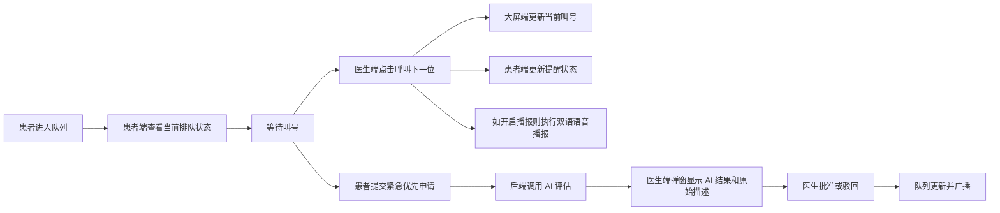

# MediQueue 产品需求文档（PRD）V2

`基于 prd_v1 审核标记重新整理`

## 1. 文档说明

### 1.1 文档目的

本文档基于 [native_description.md](./native_description.md) 的原始需求，以及 [prd_v1.md](./prd_v1.md) 中的人工审核意见，整理出一版更贴近当前交付边界的 MVP PRD。

### 1.2 V2 整理原则

本版严格遵循以下审核约定：

- `~~删除线~~` 表示该内容从 V2 中移除
- `> review意见` 表示该处内容按意见重写
- 优先保证与原题目限时交付匹配，不做额外扩张

### 1.3 产品定位

MediQueue 是一个面向医院门诊候诊场景的多端实时叫号系统，核心目标是解决以下问题：

- 老年患者看不清、听不清，容易过号
- 外籍患者看不懂中文屏幕和播报
- 特殊患者无法通过系统发起优先申请
- 医生缺少清晰队列，问诊节奏被频繁打断
- 网络异常时，各端缺乏统一、稳定、清晰的异常提示

## 2. 产品范围

### 2.1 适用范围

- 场景范围：医院门诊候诊与叫号
- 角色范围：患者、医生
- 语言范围：中文、英文
- 终端范围：医生端 Web、候诊大屏端、患者移动端 H5、后端服务

### 2.2 本轮 MVP 必须交付

本轮交付严格对应题目要求的 `3 端 + 1 后端`：

- 医生端 Web
- 候诊大屏端
- 患者端 H5
- 后端 API + WebSocket 服务

### 2.3 本轮不纳入范围

- 护士/分诊独立端
- 院方管理后台
- 审计日志体系
- 终端设备管理模型
- 多院区、多科室统一调度
- HIS/EMR 深度集成
- 纸质票据、短信通知、硬件联动

## 3. 产品目标

### 3.1 业务目标

- 让患者知道“当前叫到谁、我前面还有几人、我什么时候大致轮到”
- 让医生可以基于清晰队列发起叫号、跳过和暂停操作
- 让特殊患者可以发起“紧急优先申请”，并由医生直接做批准或驳回决策
- 让网络异常时所有终端都能明确显示断网状态和断网前最新队列状态

### 3.2 非目标

以下内容不是本轮 PRD 的目标：

- 完整门诊运营管理
- 复杂分诊流程系统化
- 医疗合规级留痕审计方案
- 除英语外的更多语言支持

## 4. 用户角色与场景

### 4.1 核心用户

| 角色 | 典型代表 | 核心诉求 |
| --- | --- | --- |
| 老年患者 | 王大爷 | 看得清、听得清、不轻易过号 |
| 外籍患者 | David Smith | 看得懂英文提示、听得懂英文播报 |
| 特殊患者 | 李女士 | 可以通过系统申请优先处理 |
| 医生 | 赵主任 | 队列清楚、减少被打断、快速做优先决策 |

### 4.2 相关但非系统用户

现场工作人员或护士依然存在于真实业务中，但本轮不为其建设独立系统端。断网时，大屏与患者端可以通过公告提示患者听从现场工作人员或护士指引。

## 5. 业务建模

### 5.1 业务对象模型

按审核意见收敛后，本轮只保留最小必要对象：

| 对象 | 说明 | 核心字段 |
| --- | --- | --- |
| Patient | 候诊患者身份信息 | `patientId`、`name`、`gender`、`englishNameOrPinyin`、`language` |
| QueueTicket | 排队票号与候诊主体 | `ticketNo`、`patient`、`roomNo`、`status`、`priorityLevel`、`checkInTime` |
| PriorityRequest | 紧急优先申请 | `requestId`、`ticketNo`、`descriptionText`、`aiResult`、`reviewStatus` |
| CallEvent | 一次叫号动作 | `eventId`、`ticketNo`、`roomNo`、`calledAt` |
| QueueSnapshot | 当前队列快照 | `snapshotVersion`、`currentCall`、`waitingList`、`isPaused` |

### 5.2 队列状态模型

`QueueTicket` 支持以下状态：

- `WAITING`：等待叫号
- `CALLED`：已被叫号，等待到诊室
- `SKIPPED`：本轮被跳过
- `IN_CONSULTATION`：已接诊
- `COMPLETED`：已完成
- `MISSED`：过号

说明：

- 本轮不把 `PAUSED` 作为票号状态
- “暂停叫号”是医生端对当前叫号流程的控制，不改变单个票号状态

### 5.3 候诊排序规则

本节用于描述“当多个患者同时处于候诊中时，系统如何决定谁更靠前”。

候诊优先级分层：

- `NORMAL`：普通排队
- `PRIORITY_REVIEWING`：已提交优先申请，等待医生审核
- `PRIORITY_APPROVED`：医生审核通过，可前移
- `RETURNING`：过号后返回队列

排序依据：

1. 医生是否已批准优先
2. 原始排队顺序
3. 当前是否仍属于有效候诊状态

### 5.4 公共信息展示规则

- 大屏以号码为主、姓名为辅
- 公共场景下中文名默认替换第二个字为 `X` 并按性别展示
- 示例：
  - `李X伟 先生`
  - `刘X菲 女士`
- 患者个人 H5 页面可展示本人完整姓名

### 5.5 核心业务规则

1. 紧急优先申请不等于自动插队。
2. 患者提交申请后，后端先执行 AI 紧急度评估。
3. AI 评估结果和患者原始输入会直接弹出到医生 Web 端，由医生决定批准或不批准。
4. 非医疗理由如“我是 VIP”“我赶时间”不能作为优先依据。
5. 医生只能操作所属诊室的队列。
6. 本轮不考虑系统级全局暂停，只考虑医生端“暂停叫号”按钮对当前叫号流程的控制。
7. 断网后，各端应鲜明显示当前断网状态，并展示断网前最新队列状态。
8. 断网期间，大屏端需循环双语公告，提示患者不要紧张并听从现场工作人员或护士指引。

### 5.6 核心业务流程



### 5.7 异常流程

- 患者未到：医生可执行“跳过当前”
- 患者过号后返回：本轮定义为 P1，先保留手动处理策略，不做复杂自动化
- 网络断开：各端进入断网展示模式，显示断网前最新状态
- AI 评估失败：医生端展示“AI 评估失败”，医生根据现场情况人工判断

## 6. 详细功能需求

### 6.1 后端服务

#### 6.1.1 队列管理

- 维护内存中的患者队列
- 初始化 10 个 mock 患者
- 每个患者至少包含：号码、姓名、性别、英文名或拼音、诊室、当前状态
- 支持以下动作：
  - 获取完整队列快照
  - 获取单个患者视角信息
  - 呼叫下一位
  - 跳过当前患者
  - 暂停叫号
  - 恢复叫号

#### 6.1.2 REST API

建议最小接口集合：

- `GET /api/queue`
- `GET /api/patient/:id`
- `POST /api/call/next`
- `POST /api/call/skip`
- `POST /api/call/pause`
- `POST /api/call/resume`
- `POST /api/priority/apply`
- `POST /api/priority/:id/review`

#### 6.1.3 WebSocket 实时广播

广播事件至少包括：

- `queue.updated`
- `call.started`
- `call.skipped`
- `call.paused`
- `call.resumed`
- `priority.reviewed`

要求：

- 医生端发起叫号后，大屏端和患者端 1 秒内同步
- 客户端断线后自动重连
- 客户端重连后主动拉取最新快照恢复状态

#### 6.1.4 紧急优先服务

- 接收患者输入的一句话描述
- 调用 LLM 做紧急度分析
- 返回结构化 JSON
- 结果不直接改队列，只供医生审批使用

### 6.2 医生端 Web

#### 6.2.1 页面目标

帮助医生快速掌握当前等候情况，并在看诊过程中快速推进叫号。

#### 6.2.2 核心功能

- 显示当前候诊队列
- 显示当前被叫号患者
- 操作“呼叫下一位”
- 操作“跳过当前”
- 操作“暂停叫号”
- 操作“恢复叫号”
- 当有紧急优先申请到来时，弹出审核框

#### 6.2.3 紧急优先申请审核弹窗

弹窗至少展示：

- 患者号码
- 患者姓名
- 患者原始输入文本
- AI 返回的紧急度结论
- AI 返回的解释说明
- 操作按钮：`批准` / `不批准`

#### 6.2.4 交互要求

- 当前叫号对象必须高亮
- 暂停状态必须明显展示
- 紧急优先审核弹窗应足够显眼，但不能阻塞医生查看当前队列

### 6.3 候诊大屏端

#### 6.3.1 页面目标

在远距离、嘈杂环境下，帮助患者快速识别当前叫号和等待顺序。

#### 6.3.2 展示内容

- 当前叫号号码
- 当前叫号姓名（按脱敏规则）
- 当前诊室号码
- 等待队列前 5 位
- 当前系统状态：正常、暂停、断网

#### 6.3.3 视觉要求

- 主号字号建议不低于 `48px`
- 高对比度配色
- 当前叫号对象高亮
- 避免密集表格排布

#### 6.3.4 文案与断网公告

- 正常状态下支持中英文界面提示
- 断网状态下循环公告：
  - 中文：`当前系统网络故障，请不要紧张，听从现场工作人员或护士指引`
  - 英文：`The queue system is temporarily offline. Please stay calm and follow the instructions of on-site staff or nurses.`

#### 6.3.5 双语语音播报

该能力保留在文档中，但从业务优先级上归为 P2。

播报模板：

- 中文：`请 {号码} 号 {姓名}，到 {诊室} 就诊`
- 英文：`Number {号码}, {英文名或拼音}, please proceed to {诊室}`

### 6.4 患者端 H5

#### 6.4.1 页面目标

帮助患者随时确认自己的候诊进度，并在被叫号时收到明显提醒。

#### 6.4.2 核心功能

- 显示我的号码
- 显示当前状态
- 显示前方人数
- 显示预计等待时间
- 显示诊室号码
- 发起紧急优先申请
- 被叫号时展示强视觉提示
- 支持震动提醒
- 支持中英文界面

#### 6.4.3 业务规则

- 患者只能查看本人相关信息
- 紧急优先申请只接受一句话描述
- 被驳回后展示简化反馈，不展示复杂医学判断
- 若浏览器不支持震动，保留视觉提醒

## 7. AI 能力需求

### 7.1 AI 紧急度评估定位

AI 紧急度评估是“紧急优先申请”的辅助能力，不作为独立主功能存在。

### 7.2 输入

- 患者一句话描述
- 可选上下文：年龄、孕周、当前科室

### 7.3 输出格式

LLM 必须返回结构化 JSON，建议字段如下：

```json
{
  "urgencyLevel": "high|medium|low|unknown",
  "medicalReason": true,
  "isAbuseSuspected": false,
  "recommendedAction": "approve_priority|reject_non_medical|manual_review",
  "explanation": "说明原因"
}
```

### 7.4 规则要求

- 能识别真实医疗紧急情况，如胸闷气短、大量出血、孕晚期腹痛
- 能识别非医疗理由，如 VIP、赶时间、赶高铁、着急上班
- 允许返回 `unknown`
- 没有 API Key 时，保留完整 Prompt 和调用逻辑，使用 Mock 返回

## 8. 非功能需求

### 8.1 实时性

- 医生发起叫号后，大屏端和患者端 1 秒内完成更新
- 页面不依赖手动刷新获取最新状态

### 8.2 一致性

- 任意终端刷新后，都能恢复到服务端最新快照
- 服务端为唯一事实来源

### 8.3 可用性

- WebSocket 自动重连
- 重连后自动拉取最新快照
- 断网时所有终端均有明确视觉提示

### 8.4 无障碍

- 大字号
- 高对比度
- 中英文双语界面
- 视觉提醒和震动提醒并存

### 8.5 隐私

- 大屏和公共信息默认姓名脱敏
- 患者端仅展示本人信息

## 9. 功能优先级矩阵

### 9.1 P0（MVP 必须完成）

| 功能 | 说明 | 理由 |
| --- | --- | --- |
| 队列实时同步 | 医生端、大屏端、患者端状态一致 | 叫号系统核心基础 |
| 医生端叫号/跳过/暂停/恢复 | 医生推进当前诊室叫号流程 | 主业务闭环必须存在 |
| 患者端个人排队信息 | 号码、前方人数、预计等待时间 | 直接缓解焦虑与重复询问 |
| 候诊大屏高可读展示 | 大字号、高对比、当前叫号高亮 | 直接解决老年患者识别问题 |
| 中英文界面 | 满足外籍患者理解需求 | 原始反馈明确提出 |
| 紧急优先申请 | 患者提交一句话描述 | 特殊患者入口必须存在 |
| 医生人工审核优先申请 | 医生基于 AI 结果决定批准/不批准 | 当前业务决策主体 |
| 页面刷新后状态恢复 | 刷新后恢复到当前正确状态 | 保证多端一致性 |

### 9.2 P1（重要但可延后）

| 功能 | 说明 | 理由 |
| --- | --- | --- |
| AI 结构化评估能力 | 作为紧急优先申请的辅助判断 | 是重要增强，但不单独作为主功能呈现 |
| 断网检测与离线降级展示 | 鲜明显示断网状态与断网前最新队列 | 重要，但可低于主叫号闭环 |
| 过号重返队列策略 | 过号后如何回到队列 | 高频问题，但可后补规则 |

### 9.3 P2（锦上添花）

| 功能 | 说明 | 理由 |
| --- | --- | --- |
| 双语语音播报 | 中文后英文播报当前叫号 | 从业务优先级看低于核心叫号同步 |
| 更细粒度隐私模式 | 更多姓名展示策略配置 | 当前先采用固定脱敏规则即可 |
| 预计等待时间智能预测 | 基于更复杂模型动态估算 | MVP 先用规则估算 |
| 患者满意度收集 | 叫号后简单反馈 | 不影响最小闭环 |

## 10. 断网降级方案

### 10.1 目标

断网场景下，不再强调继续自动推进系统，而是优先保证：

- 各端都能看见当前处于断网状态
- 各端都能看到断网前最新的队列状态
- 患者获得稳定、统一、双语的安抚与引导信息

### 10.2 触发机制

- WebSocket 心跳超时
- WebSocket 连接断开且多次重连失败
- 队列快照接口连续失败

### 10.3 各端表现

#### 医生端

- 明显显示当前断网
- 保留断网前最后一次队列快照
- 提示当前数据可能不是最新状态

#### 候诊大屏端

- 显示断网状态标识
- 保留断网前最后一次有效队列
- 循环显示中英文公告

#### 患者端

- 显示断网提示
- 保留断网前最后一次个人队列状态
- 提示“请留意现场工作人员指引”

### 10.4 恢复策略

- 网络恢复后客户端自动重连
- 重连成功后重新拉取完整队列快照
- 使用服务端最新状态覆盖断网期间的旧展示数据

## 11. 验收标准

### 11.1 场景 A：普通叫号闭环

1. 医生点击“呼叫下一位”
2. 大屏端 1 秒内更新当前号码
3. 患者端 1 秒内更新当前状态
4. 刷新任一页面后仍能恢复正确状态

### 11.2 场景 B：紧急优先申请闭环

1. 患者提交一句话描述
2. 后端返回结构化 AI 结果
3. 医生端弹出审核框
4. 医生批准或驳回后，队列立即更新并广播

### 11.3 场景 C：外籍患者可理解

1. 患者端可切换或直接显示英文界面
2. 大屏端关键提示支持英文
3. 外籍患者可理解当前叫号信息

### 11.4 场景 D：断网展示

1. 模拟 WebSocket 断开
2. 各端明显显示断网状态
3. 大屏和患者端展示断网前最新状态
4. 大屏循环显示双语安抚与引导公告
5. 网络恢复后自动拉取最新状态

### 11.5 场景 E：双语播报（如实现）

1. 医生成功叫号
2. 大屏端先播中文，再播英文
3. 英文名缺失时允许回退到拼音或号码

## 12. 风险与待确认项

### 12.1 主要风险

- AI 判断可能不稳定，仍需医生最终决策
- 浏览器 TTS 在不同机器上的效果不一致
- 预计等待时间容易受单个患者就诊时长波动影响
- 断网期间展示的是旧状态，现场需要明确指引兜底

### 12.2 待确认项

- 患者端是否默认根据浏览器语言切换中英文
- 大屏英文提示是全量英文还是关键字段英文
- 双语语音播报在本轮是仅文档保留还是实际实现 Demo

## 13. 发布建议

建议按“单诊室、单候诊区”范围进行验证，先确保：

1. 多端实时同步稳定
2. 紧急优先申请到医生审核的闭环跑通
3. 断网展示逻辑清晰可感知

在此基础上，再决定是否扩展更多业务能力。
